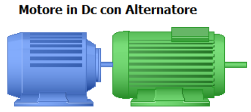
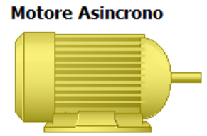
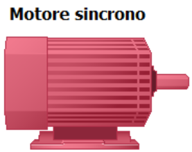
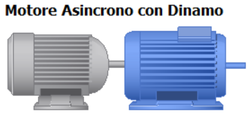

# IIS Galilei Viareggio
digital laboratory for Electrical Work Station EWS

*Laboratorio di automazione industriale realizzato con componentistica* **SIEMENS**.
*Di seguito puoi accedere alle funzionalità di ciascuna postazione EWS*

&ensp;[EWS1 azionamento Motore DC - Alternatore](/ews1.md)

&ensp;[EWS2 azionamento Motore Asincrono](/ews2.md)

&ensp;[EWS2 azionamento Motore Sincrono](/ews3.md)

&ensp;[EWS2 azionamento Motore Sincrono con Dinamo](/ews4.md)

