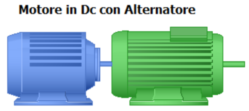

# Electric WorkStation 1
Con questa postazione puoi lavorare con un [motore in corrente continua](https://www.youtube.com/watch?v=LAtPHANEfQo) che trascina in rotazione un  [alternatore](https://www.youtube.com/watch?v=tiKH48EMgKE) 

L'esperienza di laboratorio consiste nel gestire un azionamento SIEMENS che permetterà di verificare il modello di [Bhen Eschenburg e la determinazione dell'impedenza sincrona](/libri/be.html) dell'alternatore.

  <table class="table is-bordered">
    <thead>
      <tr>
        <th>Attività da svolgere</th>
        <th>Obiettivo didattico da raggiungere</th>
      </tr>
    </thead>
    <tbody>
      <tr>
        <td>Per proseguire con l'attività di laboratorio rileva i dati di targa delle macchine DC ed AC sincrona</td>
        <td>Saper leggere i dati di targa di una macchina elettrica e saper distinguere le alimentazioni in DC ed in AC</td>
      </tr>
      <tr>
        <td>Una volta completati i dati richiesti salva il file in formato CSV in una cartella personalizzata per poterla aprire successivamente con Google Sheets</td>
        <td>Saper importare il file in un foglio di calcolo per l'analisi successiva dei dati</td>
      </tr>
      <tr>
        <td>Attraverso l'azionamento modifica la velocità di rotazione del motore in DC e misura la tensione a vuoto ai morsetti dell'alternatore riportando le misure sul foglio di lavoro. Attenzione questa attività può essere condotta SOLO in presenza dei docenti</td>
        <td>Saper tracciare il grafico della tensione a vuoto ai morsetti dell'alternatore ed il grafico dell'impedenza sincrona</td>
      </tr>
      
    </tbody>
  </table>

&ensp;[Inserisci qui i dati di targa della Macchina DC e dell'Alternatore](/elws1/acdcmachine.html)

